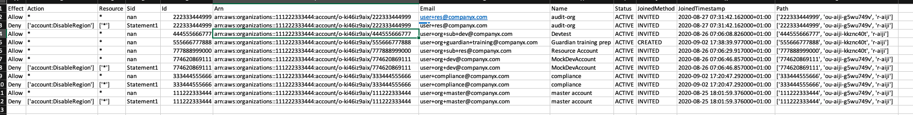

# Service Control Policy Analyzer

This tool collects and presents all the Service Control Policies (SCPs) applicable to each account in an AWS Organization. It's purpose is to help developers and security teams understand how SCPs might be blocking activities in any account of the AWS Organization.

## Sample output

## Installation

`pip install scp-analyzer` 

## Use

Obtain AWS CLI credentials to the Organizations Management account or a delegated administration account. Ensure you have Organizations Read Only permissions and run `scp-analyzer` to collect data. The tool will write output to a csv file.

## Security

See [CONTRIBUTING](CONTRIBUTING.md#security-issue-notifications) for more information.

## License

This library is licensed under the MIT-0 License. See the LICENSE file.

